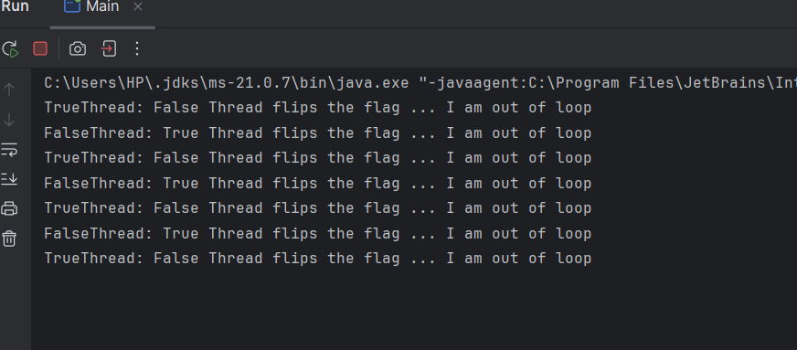
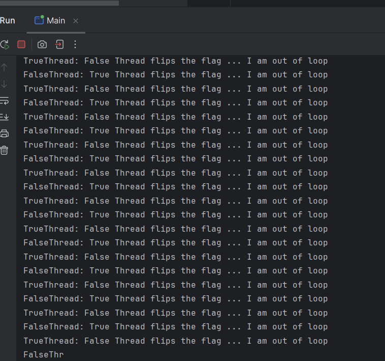

# u-thread-volatile-k-w
Avoid memory inconsistemcy 

Practice volatile k/w : avoid memory inconsistemcy (copying shared heap memory data to local cached string stack)

 -> Loop got stucked - since Thread's local cache was not updated by JVM

 -> volatile kw added. Loop works fine. Both threads are running and does not get stuck.
